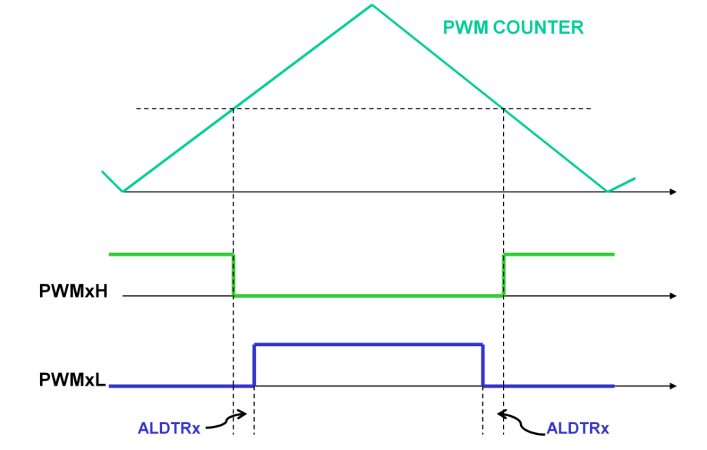
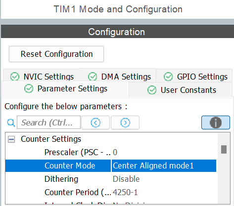
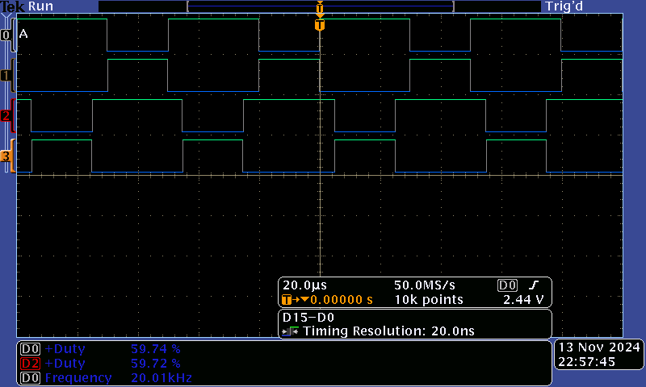
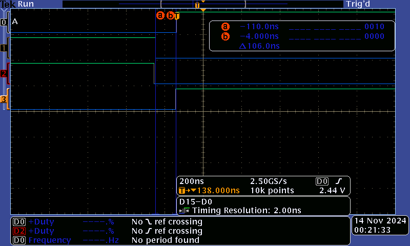
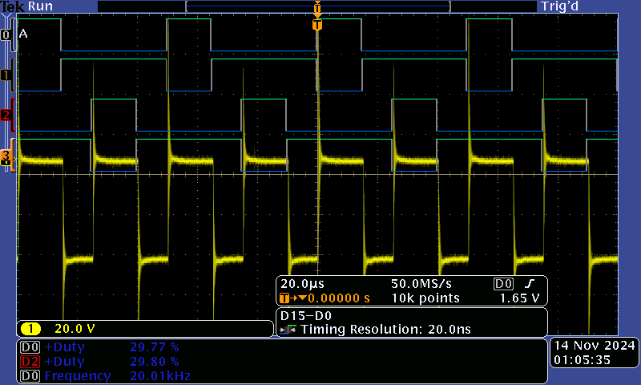
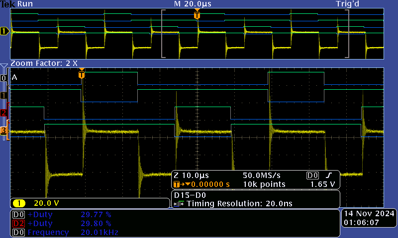
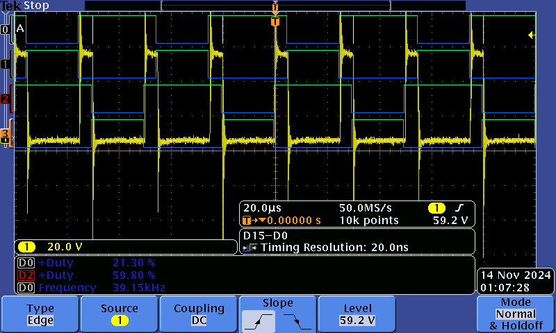

# TP Actionneur

Ce TP est réalisé par Jean-Philippe THOMAR et Paul Boulot, sous la supervision du professeur Alexis MARTIN. 

## Objectifs généraux 
A partir d'un hacheur complet et d'une carte Nucleo-STM32G474RE, nous allons  :
- Réaliser un shell pour commander le hacheur,
- Réaliser la commande des 4 transistors du hacheur en commande complémentaire décalée,
- Faire l'acquisition des différents capteurs,
- Réaliser l'asservissement en temps réel.

## Séance 1 : Commande MCC basique

### Objectifs de la séance 

- Générer 4 PWM en complémentaire décalée pour contrôler en boucle ouverte le moteur en respectant le cahier des charges,
- Inclure le temps mort,
- Vérifier les signaux de commande à l'oscilloscope,
- Prendre en main le hacheur,
- Faire un premier essai de commande moteur.

### 1. Génération de 4 PWM

#### Rôle du dead-time
Afin de ne pas détruire les transistors du hacheur lors de la commutation de ces derniers, il est nécessaire de générer des signaux PWM avec un délai (les valeurs de la datasheet nous indiquent "turn off delay time 39ns" et "fall time 35ns"). On choisit donc de prendre une valeur de sécurité de 100ns pour nos dead-time.

#### Configuration du dead-time
On a tDTS = 1/f_sysclk et x la valeur du dead time dans la configuration du timer 1 (comprise entre 0 et 255).  
Si x <= 127 alors DT = x * tDTS.  
Si 128 <= x <= 191 alors DT = (64+x[5:0]) * 2 * tDTS.  
Si 192 <= x <= 233 alors DT = (32+x[4:0]) * 8 * tDTS.  
Si 233 <= x <= 255 alors DT = (32+x[4:0]) * 16 * tDTS.  

Ici tDTS = 1/170 MHz = 5.88 ns  
On veut un dead-time d'environ 100 ns donc on choisit x = 15

Enfin, pour obtenir le décalage de T/2, on configure le comptage du timer 1 en "center aligned mode 1". Cependant en faisant cela on divise par deux la fréquence de nos PWM. On doit donc changer la configuration du timer pour double la fréquence et ainsi atteindre de nouveau 20kHz. ARR = 4250 (car 170M/4250 = 40kHz)
<p align="center" >  </p>
Figure 1. Schéma comptage aligné centré

<p align="center" >  </p>
Figure 2. 4 Configuration TIM1

<p align="center" >  </p>
Figure 3. 4 PWM en complémentaire décalé

<p align="center">  </p>
Figure 4. Temps mort d'environ 100ns pour la commutation des transistors

### 2. Commande de vitesse
Code de la commande de vitesse
```C
else if(argc == 2 && strcmp(argv[0], "speed") == 0){	//commande de vitesse du moteur avec changement progressif
			//on vérifie que le nombre d'arguments est valide et que le premier porte le bon nom de commande
			percentage = atoi(argv[1]);  // Convertit l'argument en pourcentage

			if(percentage>=0 && percentage<=100){	//test sur la valeur de vitesse entrée avant de modifier la vitesse du moteur

				while(trigger!=percentage){
					if(trigger>percentage){
						trigger -= pas;
						setPWM(trigger);
					}
					else{
						trigger += pas;
						setPWM(trigger);
					}
					HAL_Delay(delai);
				}
			}
}
```
La fonction atoi() permet de convertir le deuxième argument en entier afin de l'utiliser pour fixer la vitesse du moteur.

### 3. Premiers tests
<p align="center">  </p>
Figure 5. Signal du moteur en marche arrière avec un rapport cyclique de 30% (signal jaune)

<p align="center">  </p>
Figure 6. Signal du moteur en marche arrière avec un rapport cyclique de 40% (signal jaune)

<p align="center">  </p>
Figure 7. Signal du moteur en marche avant avec un rapport cyclique de 60% (signal jaune)

## Séance 2 : Commande en boucle ouverte, mesure de vitesse et de courant 

### 1. Commande de la vitesse 

### 2. Mesure de courant 

### 3. Mesure de la vitesse

 
